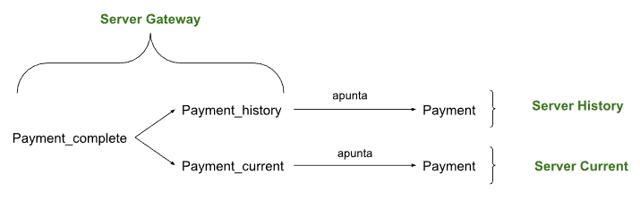

# Distribución y fragmentación de datos en PostgreSQL

En esta nueva práctica con PostgreSQL vamos a trabajar la distribución y fragmentación de los datos.

Para poder verlo de manera clara, vamos a crear un entorno virtual de 3 máquinas con un Ubuntu Server 24.04 en VirtualBox.
Cada una de estas máquinas tendrá PostgreSQL con la base de datos **dvdrental** que restauramos en la primera práctica. Para hacerlo más fácil en la primera máquina que luego replicaré, usaré los pasos que documenté en la práctica 1 (instalación de PostgreSQL) y en la práctica 2 (restauración de la base de datos “dvdrental”).

Las 3 máquinas serán:

Server 1 (gateway) - 192.168.60.1

Server 2 (current) - 192.168.60.2

Server 3 (history) - 192.168.60.3

> [!NOTE]
> Además, dispondré de una cuarta máquina con Ubuntu Desktop 24.04 LTS con entorno gráfico para poder conectarme mediante SSH y recopilar las salidas de las terminales de los servidores. Su IP será la 192.168.60.4.

---

En la máquina current se nos demanda borrar los pagos anteriores a 2007-05-01:

```bash
joel@joelserver-current:~$ sudo -i -u postgres
[sudo] password for joel: 
postgres@joelserver-current:~$ psql -d dvdrental
psql (18.1 (Ubuntu 18.1-1.pgdg24.04+2))
Digite «help» para obtener ayuda.

dvdrental=# 
```

Con esta consulta podremos ver los registros que vamos a borrar:

```bash
dvdrental=# SELECT COUNT(*) FROM payment WHERE payment_date < '2007-05-01';
 count 
-------
 14414
(1 fila)
```

Y para borrarlos usaremos esta otra consulta:

```bash
dvdrental=# DELETE FROM payment WHERE payment_date < '2007-05-01';
DELETE 14414
```

Ahora vamos con el server **history** en el que se nos demanda borrar los pagos desde 2007-05-01 en adelante:

Siguiendo el mismo procedimiento anterior, primero entraremos en la base de datos, consultaremos los registros a borrar y luego los borraremos.

```bash
joel@joelserver-history:~$ sudo -i -u postgres
[sudo] password for joel: 
postgres@joelserver-history:~$ psql -d dvdrental
psql (18.1 (Ubuntu 18.1-1.pgdg24.04+2))
Digite «help» para obtener ayuda.

dvdrental=# 
```
```bash
dvdrental=# SELECT COUNT(*) FROM payment WHERE payment_date >= '2007-05-01';
 count 
-------
   182
(1 fila)
dvdrental=# DELETE FROM payment WHERE payment_date >= '2007-05-01';
DELETE 182
```

A continuación vamos al tercer servidor **gateway** en el que se nos demanda eliminar por completo la tabla **payment** porque será aquí donde se importarán las tablas foráneas “payment_current” y “payment_history”.

```bash
joel@joelserver-gateway:~$ sudo -i -u postgres
[sudo] password for joel: 
postgres@joelserver-gateway:~$ psql -d dvdrental
psql (18.1 (Ubuntu 18.1-1.pgdg24.04+2))
Digite «help» para obtener ayuda.

dvdrental=# 
```
```bash
dvdrental=# DROP TABLE IF EXISTS payment CASCADE;
NOTICE:  eliminando además 2 objetos más
DETALLE:  eliminando además vista sales_by_film_category
eliminando además vista sales_by_store
DROP TABLE
dvdrental=#
```

> [!NOTE] 
> En este caso, al ejecutar la consulta con CASCADE, todas las tablas dependientes de la tabla payment son eliminadas también. Por eso mismo nos aparece tras ejecutar la consulta que se han eliminado las tablas sales_by_film_category y sales_by_store. No nos va a influir porque en este servidor lo que queremos es recrear la tabla completa con la herencia de las otras dos tablas, y en caso de querer poder consultar desde el server gateway esas dos tablas, una vez completada la herencia, podríamos generar unas vistas a esas dos tablas.

Acto seguido, deberemos habilitar FDW (Foreign Data Wrapper), una extensión de PostgreSQL que actúa como forma de enlace entre el servidor donde lo activamos y otras fuentes de datos externas, como otras bases de datos. En este caso, nuestros PostgreSQL de los servers current y history.

Para habilitarlo deberemos ejecutar en el **server gateway** el siguiente comando:

```bash
dvdrental=# CREATE EXTENSION IF NOT EXISTS postgres_fdw;
CREATE EXTENSION
```

Ya añadida la extensión vamos a crear los servidores FDW hacia current y history:

```bash
dvdrental=# CREATE SERVER history_server
FOREIGN DATA WRAPPER postgres_fdw
OPTIONS (host '192.168.60.2', port '5432', dbname 'dvdrental');

CREATE SERVER current_server
FOREIGN DATA WRAPPER postgres_fdw
OPTIONS (host '192.168.60.1', port '5432', dbname 'dvdrental');
CREATE SERVER
CREATE SERVER
dvdrental=# 
```

Ahora vamos a crear el usuario remoto con el que accederemos a ese servidor FDW donde encontraremos la tabla combinada.

> [!NOTE] 
> A dicho usuario se le conoce como **user mapping**. El usuario con el que hacemos la conexión FDW. No tiene porque llamarse igual que el usuario con el que estamos trabajando en local (**postgres**) pero si usamos otro ese usuario deberemos de crearlo antes en el servidor remoto.

En nuestro caso le vamos a llamar **postgres** igual que con el que accedemos en local a nuestro servidor **gateway**. La contraseña será **joel**.

```bash
dvdrental=# CREATE USER MAPPING FOR postgres
SERVER history_server
OPTIONS (user 'postgres', password 'joel');

CREATE USER MAPPING FOR postgres
SERVER current_server
OPTIONS (user 'postgres', password 'joel');
CREATE USER MAPPING
CREATE USER MAPPING
```

Acto seguido, vamos a la tabla **payment_complete** que será la tabla padre que heredará los datos de las otras dos tablas. Pero para ello primero deberemos saber la estructura de la tabla **payment** de alguno de los otros dos servidores (**current** y **history**).

Si nos vamos por ejemplo a la tabla payment del servidor history, y aplicamos el siguiente comando, podremos averiguar su estructura:

```bash
dvdrental=# \d payment
                                               Tabla «public.payment»
   Columna    |            Tipo             | Ordenamiento | Nulable  |                 Por omisión                 
--------------+-----------------------------+--------------+----------+---------------------------------------------
 payment_id   | integer                     |              | not null | nextval('payment_payment_id_seq'::regclass)
 customer_id  | smallint                    |              | not null | 
 staff_id     | smallint                    |              | not null | 
 rental_id    | integer                     |              | not null | 
 amount       | numeric(5,2)                |              | not null | 
 payment_date | timestamp without time zone |              | not null | 
Índices:
    "payment_pkey" PRIMARY KEY, btree (payment_id)
    "idx_fk_customer_id" btree (customer_id)
    "idx_fk_rental_id" btree (rental_id)
    "idx_fk_staff_id" btree (staff_id)
Restricciones de llave foránea:
    "payment_customer_id_fkey" FOREIGN KEY (customer_id) REFERENCES customer(customer_id) ON UPDATE CASCADE ON DELETE RESTRICT
    "payment_rental_id_fkey" FOREIGN KEY (rental_id) REFERENCES rental(rental_id) ON UPDATE CASCADE ON DELETE SET NULL
    "payment_staff_id_fkey" FOREIGN KEY (staff_id) REFERENCES staff(staff_id) ON UPDATE CASCADE ON DELETE RESTRICT
```

A raíz de conocer su estructura, podemos crear el comando para crear la tabla “padre”:

```bash
dvdrental=# CREATE TABLE payment_complete (
    payment_id   integer NOT NULL,
    customer_id  smallint NOT NULL,
    staff_id     smallint NOT NULL,
    rental_id    integer NOT NULL,
    amount       numeric(5,2) NOT NULL,
    payment_date timestamp without time zone NOT NULL
);
CREATE TABLE
```

> [!NOTE] 
> Aquí es importante entender que no añadimos claves ni restricciones porque la tabla **payment_complete** no va a almacenar datos, sino que esos datos van a estar en las tablas de los servidores current y history. Serán las tablas foráneas que crearemos las que apuntarán a las tablas originales, y éstas son las que contendrán las restricciones y claves.



Ahora vamos a crear las tablas hijas de la **payment_complete** y foráneas, que apuntarán a las originales de los otros dos servidores.

Para ello, siguiendo la misma estructura de la tabla **payment**, crearemos estas dos:

```bash
dvdrental=# CREATE FOREIGN TABLE payment_history (
    payment_id   integer,
    customer_id  smallint,
    staff_id     smallint,
    rental_id    integer,
    amount       numeric(5,2),
    payment_date timestamp without time zone
)
INHERITS (payment_complete)
SERVER history_server
OPTIONS (schema_name 'public', table_name 'payment');
```
```bash
CREATE FOREIGN TABLE payment_current (
    payment_id   integer,
    customer_id  smallint,
    staff_id     smallint,
    rental_id    integer,
    amount       numeric(5,2),
    payment_date timestamp without time zone
)
INHERITS (payment_complete)
SERVER current_server
OPTIONS (schema_name 'public', table_name 'payment');
NOTICE:  mezclando la columna «payment_id» con la definición heredada
NOTICE:  mezclando la columna «customer_id» con la definición heredada
NOTICE:  mezclando la columna «staff_id» con la definición heredada
NOTICE:  mezclando la columna «rental_id» con la definición heredada
NOTICE:  mezclando la columna «amount» con la definición heredada
NOTICE:  mezclando la columna «payment_date» con la definición heredada
CREATE FOREIGN TABLE
NOTICE:  mezclando la columna «payment_id» con la definición heredada
NOTICE:  mezclando la columna «customer_id» con la definición heredada
NOTICE:  mezclando la columna «staff_id» con la definición heredada
NOTICE:  mezclando la columna «rental_id» con la definición heredada
NOTICE:  mezclando la columna «amount» con la definición heredada
NOTICE:  mezclando la columna «payment_date» con la definición heredada
CREATE FOREIGN TABLE
dvdrental=# 
```

> [!NOTE] 
> “INHERITS (payment_complete)” indica que son “hijas” de la tabla “padre”.
> “OPTIONS (schema_name 'public', table_name 'payment')” es el puntero que apunta hacia la tabla original.

Podemos hacer una verificación rápida pero eficaz, contando los registros de las tablas con una consulta y viendo como ambas son hijas de la tabla **payment_complete**.

```bash
dvdrental=# SELECT COUNT(*) FROM payment_history;
 count 
-------
 14414
(1 fila)

dvdrental=# SELECT COUNT(*) FROM payment_current;
 count 
-------
   182
(1 fila)
```
```bash
dvdrental=# SELECT COUNT(*) FROM payment_complete;
 count 
-------
 14596
(1 fila)
```

Y tal y como se observa, la tabla **payment_complete** reúne el mismo número de registros.
